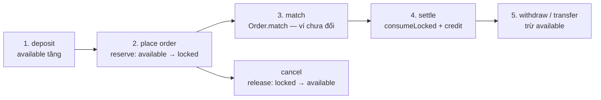

# SENIOR-NOTES — Lộ trình bài tập & ghi chú senior

*File cá nhân: viết flow, trả lời phỏng vấn, design note. Bám project `domain-driven-design-bank`.*

---

## Mục lục

- [Nguyên tắc: hiểu hệ thống trước](#nguyên-tắc-hiểu-hệ-thống-trước)
- [PHẦN A — Hiểu hệ thống](#phần-a--hiểu-hệ-thống)
- [PHẦN B — Feature đã làm (ôn)](#phần-b--feature-đã-làm-ôn)
- [PHẦN C — Test checklist](#phần-c--test-checklist) *(sau khi xong A + B)*
- [PHẦN D — Doc & vận hành](#phần-d--doc--vận-hành)
- [PHẦN E — Feature senior (chọn 1)](#phần-e--feature-senior-chọn-1) *(sau khi xong A)*
- [PHẦN F — System design](#phần-f--system-design)
- [PHẦN G — Phỏng vấn & portfolio](#phần-g--phỏng-vấn--portfolio)
- [Checklist tổng](#checklist-tổng)
- [Thứ tự làm theo giai đoạn](#thứ-tự-làm-theo-giai-đoạn)

---

## Nguyên tắc: hiểu hệ thống trước

**Làm xong PHẦN A (+ ôn B) trước khi** viết test (C), feature mới (E), system design (F).

Lý do: đã code được nhưng cần **bản đồ mental model** — biết mảnh nào nối mảnh nào. Hiểu trước thì test/feature không thành copy mù.

### Thứ tự ưu tiên (chỉ PHẦN A + B trước)

| Thứ tự | Bài | Việc | Ước lượng |
|---|---|---|---|
| 1 | **A0** | 3 vòng hiểu hệ thống (dưới đây) | 3 buổi |
| 2 | **A1** | Place order — viết kỹ nhất | 1–2 giờ |
| 3 | **A2** | 11 API còn lại — bullet ngắn | 2 giờ |
| 4 | **A3** | Sơ đồ layer | 30 phút |
| 5 | **A4** | 5 câu phỏng vấn | 1 giờ |
| 6 | **B1–B3** | Ôn 3 API tự code | 1 giờ |

**Chưa cần (để sau):** C test, E feature senior, F system design.

---

### A0 — Ba vòng “hiểu hết hệ thống”

**Status tổng A0:** [x] Vòng 1 / [ ] Vòng 2 / [ ] Vòng 3 / [ ] Xong cả 3

#### Vòng 1 — Luồng tiền (available / locked)

**Mục tiêu:** Trace tiền từ nạp → treo lệnh → khớp → settle → rút / transfer.

**Bài tập:** Vẽ 1 dòng thời gian (bullet hoặc mermaid) các bước sau, ghi **class/method** chính:

```
deposit → available tăng
place order → reserve (available → locked)
match → Order.match (domain, chưa trừ ví)
settle → consumeLocked + credit (2 account)
cancel → release (locked → available)
withdraw / transfer → trừ available
```

**Ghi chú của tôi (Vòng 1):**



**1. `deposit` — nạp từ ngoài**

- Class/method: `DepositApplicationService.deposit` → `Account.deposit` → `Balance.credit`
- Available **tăng**, locked **không đổi**
- FROZEN vẫn nạp được
- **Không nhầm với `credit` lúc settle** (xem bước 4)

**2. `place order` — treo tiền**

- Class/method: `PlaceOrderApplicationService` → `Account.reserve` → `Balance.reserve` → `Order.initializeLock`
- Available **giảm**, locked **tăng** (cùng số)
- BUY: lock **VND** = `price × quantity`
- SELL: lock **BTC** = `quantity`
- DB: `account_balances.locked` + `orders.locked_amount_remaining`

**3. `match` — khớp trên sổ lệnh**

- Class/method: `OrderMatchingService.match` → `Order.match`
- Chỉ đổi `filledQuantity` + `status` (PENDING → PARTIALLY_FILLED / FILLED)
- **Ví không đổi** — chưa consumeLocked, chưa credit
- Tạo `Trade` (VO trên RAM), chưa INSERT bảng `trades`

**4. `settle` — tất toán 2 ví**

- Class/method: `TradeSettlementService.settle`
  - Bên chi: `Account.consumeLocked` → `Balance.consumeLocked` (locked **giảm**, available **không tăng lại** — tiền đi thật)
  - Bên nhận: `Account.credit` → `Balance.credit` (available **tăng**)
  - `Order.reduceLock` trên lệnh vừa khớp
- Buyer: mất VND locked, nhận BTC available
- Seller: mất BTC locked, nhận VND available
- BUY LIMIT giá cao hơn giá khớp: `release` phần VND lock thừa
- Lưu `ExecutedTrade` → bảng `trades`
- **`credit` ≠ `deposit`:** credit = nhận sau khớp; deposit = admin nạp từ ngoài

**5. `cancel` — hủy phần còn treo**

- Class/method: `CancelOrderApplicationService` → `Account.release` → `Balance.release` → `Order.reduceLock` / `Order.cancel`
- Locked **giảm**, available **tăng** (trả lại)
- Chỉ hoàn **lock còn lại** — phần đã settle **không đảo**

**6. `withdraw` / `transfer` — trừ available**

- Withdraw: `WithdrawApplicationService` → `Account.withdraw` → `Balance.debitAvailable` — available **giảm**
- Transfer: `TransferApplicationService` → `from.withdraw` + `to.deposit` — available bên gửi giảm, bên nhận tăng
- Không đụng locked; FROZEN không withdraw / không transfer **from**

**Bảng nhớ nhanh**

| Bước | Available | Locked |
|---|---|---|
| deposit | ↑ | — |
| reserve (place) | ↓ | ↑ |
| match | — | — |
| consumeLocked (settle chi) | — | ↓ (tiền đi) |
| credit (settle nhận) | ↑ | — |
| release (cancel / lock thừa) | ↑ | ↓ |
| withdraw | ↓ | — |
| transfer | from ↓ / to ↑ | — |

**Pass:** Giải thích được “tiền đang ở available hay locked” tại mỗi bước, không nhầm deposit vs credit.

---

#### Vòng 2 — Luồng quyền (auth / RBAC)

**Mục tiêu:** Hiểu 2 lớp permission — JWT vs bảng `resources`.

**Bài tập:** Điền bảng + trả lời 3 câu:

| Bước | Xảy ra ở đâu | Fail thì HTTP gì |
|---|---|---|
| Login → JWT chứa permissions | | |
| JwtAuthFilter — ai đang login | | |
| AuthorizationFilter — URL map permission | | |
| OwnershipChecker — user ↔ accountId | | |

**3 câu:**
1. JWT có `ACCOUNT_WITHDRAW` nhưng vẫn 403 — vì sao?
2. Admin (không gắn account) freeze ACC-001 được không?
3. trader1 gọi GET ACC-002 → lỗi gì?

**Ghi chú của tôi (Vòng 2):**

*(viết ở đây)*

**Pass:** Debug 403 biết check `resources` trước hay `role_permissions` trước; biết restart app sau INSERT resources.

---

#### Vòng 3 — Luồng trạng thái (lifecycle)

**Mục tiêu:** Order + Account status ảnh hưởng API nào.

**Bài tập:** Điền bảng:

**Order**

| Status | API / method còn được gọi? | Không được? |
|---|---|---|
| PENDING | | |
| PARTIALLY_FILLED | | |
| FILLED | | |
| CANCELLED | | |

**Account**

| Status | deposit | withdraw | reserve (place) | transfer from | transfer to |
|---|---|---|---|---|---|
| ACTIVE | | | | | |
| FROZEN | | | | | |

**Ghi chú của tôi (Vòng 3):**

*(viết ở đây)*

**Pass:** Nói được freeze ACC-001 → withdraw / place order fail; deposit vẫn OK (theo domain hiện tại).

---

### Dấu hiệu đã “hiểu hệ thống” (trước khi sang PHẦN C)

- [ ] Chỉ tên API bất kỳ → nói layer + class chính trong **30 giây**
- [ ] Giải thích **place order** không mở IDE (**5 phút**)
- [ ] Biết **không** đặt list query / rule nghiệp vụ sai chỗ (Controller, Entity domain)
- [ ] Trace được 1 lệnh BUY từ curl → thay đổi số dư ACC-001 (available/locked)

---

## PHẦN A — Hiểu hệ thống

### A1 — Flow Place Order (7 bước, không mở IDE)

**Status:** [ ] Chưa / [ ] Đang làm / [ ] Xong — review

1. Controller nhận gì → map sang VO gì:
   - *(viết ở đây)*

2. Ownership / permission:
   - *(viết ở đây)*

3. Tạo Order + reserve (BUY lock VND / SELL lock BTC):
   - *(viết ở đây)*

4. OrderMatchingService.match:
   - *(viết ở đây)*

5. TradeSettlementService settle 2 ví:
   - *(viết ở đây)*

6. Save (order, account, trade, orderbook…):
   - *(viết ở đây)*

7. Event / side effect (nếu có):
   - *(viết ở đây)*

---

### A2 — Flow ngắn các API còn lại

**Status:** [ ] Chưa / [ ] Đang làm / [ ] Xong

#### Auth

| API | Flow (3–5 bullet) |
|---|---|
| `POST /api/auth/login` | |
| `POST /api/auth/refresh` | |
| `POST /api/auth/logout` | |

#### Account

| API | Flow |
|---|---|
| `GET /api/accounts/{accountId}` | |
| `POST /api/accounts` (create) | |
| `POST .../deposit` | |
| `POST .../withdraw` | |
| `GET .../orders` ✅ | |
| `POST /api/accounts/transfer` ✅ | |
| `POST .../freeze` ✅ | |
| `POST .../unfreeze` ✅ | |

#### Order

| API | Flow |
|---|---|
| `POST /api/orders` (place) | → xem A1 |
| `GET /api/orders/{orderId}` | |
| `DELETE /api/orders/{orderId}` (cancel) | |

---

### A3 — Sơ đồ kiến trúc

**Status:** [ ] Chưa / [ ] Xong

```mermaid
%% Vẽ flow: Client → Controller → Application → Domain → Repository → DB
```

*(Ghi chú thêm 1 request ví dụ, vd withdraw)*

---

### A4 — 5 câu phỏng vấn (trả lời bằng code project)

**Status:** [ ] Chưa / [ ] Xong

**1. Aggregate Root là gì? Ví dụ trong project?**

*(viết ở đây)*

**2. VO vs Entity? Ví dụ?**

*(viết ở đây)*

**3. Application Service vs Domain — khác nhau thế nào?**

*(viết ở đây)*

**4. Vì sao list orders không viết method trong class Order?**

*(viết ở đây)*

**5. Invariant — 3 ví dụ cụ thể?**

*(viết ở đây)*

---

## PHẦN B — Feature đã làm (ôn)

**Status:** [ ] Đã ôn curl + giải thích miệng

### B1 — List orders by account ✅

- Flow 5 bullet:
- Curl đã test:

### B2 — Transfer ✅

- Vì sao 2 aggregate, 1 transaction:
- Curl đã test:

### B3 — Freeze / Unfreeze ✅

- FROZEN ảnh hưởng API nào:
- Curl đã test:

---

## PHẦN C — Test checklist

| Bài | File | Status |
|---|---|---|
| C1 | `AccountTest` — FROZEN withdraw, freeze 2 lần, unfreeze ACTIVE, withdraw vượt available | [ ] |
| C2 | `OrderTest` — match vượt qty, cancel FILLED | [ ] |
| C3 | `TransferApplicationServiceTest` — from=to, không đủ tiền | [ ] |
| C4 | Freeze — account not found | [ ] |
| C5 | `PlaceOrderApplicationServiceEventTest` — reserve VND đúng | [ ] |

```bash
mvn test
```

---

## PHẦN D — Doc & vận hành

| Bài | Việc | Status |
|---|---|---|
| D1 | Cập nhật `TAI-LIEU.md` — API mới + curl + permission | [ ] |
| D2 | Kịch bản E2E 15 bước | [ ] |
| D3 | Permission debug cheat sheet + SQL | [ ] |

### D3 — Permission cheat sheet (draft)

| Triệu chứng | Nguyên nhân | Sửa |
|---|---|---|
| 403 "Không có rule quyền" | | |
| 403 "Thiếu quyền" | | |
| JWT có permission nhưng vẫn 403 | | |

---

## PHẦN E — Feature senior (chọn 1)

**Chọn:** [ ] E1 BUY MARKET  [ ] E2 GET Order Book  [ ] E3 List trades by order

### Design note (sau khi làm)

- Vấn đề:
- Giải pháp:
- Trade-off:
- Invariant liên quan:

---

## PHẦN F — System design

| Bài | Status |
|---|---|
| F1 — Concurrent withdraw (design note) | [ ] |
| F2 — Idempotency transfer (optional code) | [ ] |
| F3 — Code review giả (`BAD-EXAMPLE.md`) | [ ] |

---

## PHẦN G — Phỏng vấn & portfolio

### G1 — Portfolio blurb (~150 từ)

*(viết ở đây)*

### G2 — Mock interview (ghi câu trả lời)

1. Walk through place order:
2. Transfer vs exchange:
3. FROZEN ảnh hưởng gì:
4. Permission 2 lớp (JWT vs resources):
5. Admin sửa balance tay — đặt ở đâu:

---

## Checklist tổng

### Giai đoạn 1 — Hiểu hệ thống (làm trước)

```
[x] A0 Vòng 1 — Luồng tiền
[ ] A0 Vòng 2 — Luồng quyền
[ ] A0 Vòng 3 — Luồng trạng thái
[ ] A1 Place order flow
[ ] A2 All API flows
[ ] A3 Architecture diagram
[ ] A4 Five interview answers
[ ] B1-B3 Review done features
[ ] Pass: hiểu hệ thống (4 dấu hiệu ở trên)
```

### Giai đoạn 2 — Chứng minh & mở rộng (sau giai đoạn 1)

```
[ ] C1-C5 Tests green
[ ] D1 TAI-LIEU updated
[ ] D2 E2E scenario
[ ] D3 Permission cheat sheet
[ ] E* One senior feature
[ ] F1 or F3 System thinking
[ ] G1 Portfolio blurb
[ ] G2 Mock interview
```

---

## Thứ tự làm theo giai đoạn

| Giai đoạn | Nội dung | Ước lượng (part-time) |
|---|---|---|
| **1** | A0 → A1 → A2 → A3 → A4 → B | ~1 tuần |
| **2** | C (test) + D (doc) | ~1 tuần |
| **3** | E (1 feature senior) | ~1–2 tuần |
| **4** | F + G (design + phỏng vấn) | ~3–5 ngày |

---

*Bắt đầu: **A0 Vòng 1** (luồng tiền) → **A1** (place order). Gửi A0/A1 để review. Chưa làm PHẦN C.*
