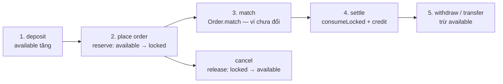
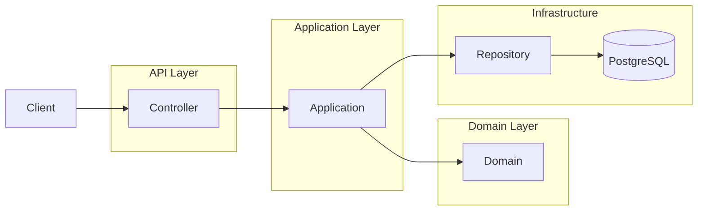

# SENIOR-NOTES — Lộ trình bài tập & ghi chú senior

*File cá nhân: viết flow, trả lời phỏng vấn, design note. Bám project `domain-driven-design-bank`.*

---

## Mục lục

- [Nguyên tắc: hiểu hệ thống trước](#nguyên-tắc-hiểu-hệ-thống-trước)
- [PHẦN A — Hiểu hệ thống](#phần-a--hiểu-hệ-thống)
- [PHẦN B — Feature đã làm (ôn)](#phần-b--feature-đã-làm-ôn)
- [PHẦN C — Test checklist](#phần-c--test-checklist) *(sau khi xong A + B)*
- [PHẦN D — Doc & vận hành](#phần-d--doc--vận-hành)
- [PHẦN E — Feature senior (chọn 1)](#phần-e--feature-senior-chọn-1) *(sau khi xong A)*
- [PHẦN F — System design](#phần-f--system-design)
- [PHẦN G — Phỏng vấn & portfolio](#phần-g--phỏng-vấn--portfolio)
- [Checklist tổng](#checklist-tổng)
- [Thứ tự làm theo giai đoạn](#thứ-tự-làm-theo-giai-đoạn)

---

## Nguyên tắc: hiểu hệ thống trước

**Làm xong PHẦN A (+ ôn B) trước khi** viết test (C), feature mới (E), system design (F).

Lý do: đã code được nhưng cần **bản đồ mental model** — biết mảnh nào nối mảnh nào. Hiểu trước thì test/feature không thành copy mù.

### Thứ tự ưu tiên (chỉ PHẦN A + B trước)

| Thứ tự | Bài | Việc | Ước lượng |
|---|---|---|---|
| 1 | **A0** | 3 vòng hiểu hệ thống (dưới đây) | 3 buổi |
| 2 | **A1** | Place order — viết kỹ nhất | 1–2 giờ |
| 3 | **A2** | 11 API còn lại — bullet ngắn | 2 giờ |
| 4 | **A3** | Sơ đồ layer | 30 phút |
| 5 | **A4** | 5 câu phỏng vấn | 1 giờ |
| 6 | **B1–B3** | Ôn 3 API tự code | 1 giờ |

**Chưa cần (để sau):** C test, E feature senior, F system design.

---

### A0 — Ba vòng “hiểu hết hệ thống”

**Status tổng A0:** [x] Vòng 1 / [x] Vòng 2 / [x] Vòng 3 / [x] Xong cả 3

#### Vòng 1 — Luồng tiền (available / locked)

**Mục tiêu:** Trace tiền từ nạp → treo lệnh → khớp → settle → rút / transfer.

**Bài tập:** Vẽ 1 dòng thời gian (bullet hoặc mermaid) các bước sau, ghi **class/method** chính:

```
deposit → available tăng
place order → reserve (available → locked)
match → Order.match (domain, chưa trừ ví)
settle → consumeLocked + credit (2 account)
cancel → release (locked → available)
withdraw / transfer → trừ available
```

**Ghi chú của tôi (Vòng 1):**



**1. `deposit` — nạp từ ngoài**

- Class/method: `DepositApplicationService.deposit` → `Account.deposit` → `Balance.credit`
- Available **tăng**, locked **không đổi**
- FROZEN vẫn nạp được
- **Không nhầm với `credit` lúc settle** (xem bước 4)

**2. `place order` — treo tiền**

- Class/method: `PlaceOrderApplicationService` → `Account.reserve` → `Balance.reserve` → `Order.initializeLock`
- Available **giảm**, locked **tăng** (cùng số)
- BUY: lock **VND** = `price × quantity`
- SELL: lock **BTC** = `quantity`
- DB: `account_balances.locked` + `orders.locked_amount_remaining`

**3. `match` — khớp trên sổ lệnh**

- Class/method: `OrderMatchingService.match` → `Order.match`
- Chỉ đổi `filledQuantity` + `status` (PENDING → PARTIALLY_FILLED / FILLED)
- **Ví không đổi** — chưa consumeLocked, chưa credit
- Tạo `Trade` (VO trên RAM), chưa INSERT bảng `trades`

**4. `settle` — tất toán 2 ví**

- Class/method: `TradeSettlementService.settle`
  - Bên chi: `Account.consumeLocked` → `Balance.consumeLocked` (locked **giảm**, available **không tăng lại** — tiền đi thật)
  - Bên nhận: `Account.credit` → `Balance.credit` (available **tăng**)
  - `Order.reduceLock` trên lệnh vừa khớp
- Buyer: mất VND locked, nhận BTC available
- Seller: mất BTC locked, nhận VND available
- BUY LIMIT giá cao hơn giá khớp: `release` phần VND lock thừa
- Lưu `ExecutedTrade` → bảng `trades`
- **`credit` ≠ `deposit`:** credit = nhận sau khớp; deposit = admin nạp từ ngoài

**5. `cancel` — hủy phần còn treo**

- Class/method: `CancelOrderApplicationService` → `Account.release` → `Balance.release` → `Order.reduceLock` / `Order.cancel`
- Locked **giảm**, available **tăng** (trả lại)
- Chỉ hoàn **lock còn lại** — phần đã settle **không đảo**

**6. `withdraw` / `transfer` — trừ available**

- Withdraw: `WithdrawApplicationService` → `Account.withdraw` → `Balance.debitAvailable` — available **giảm**
- Transfer: `TransferApplicationService` → `from.withdraw` + `to.deposit` — available bên gửi giảm, bên nhận tăng
- Không đụng locked; FROZEN không withdraw / không transfer **from**

**Bảng nhớ nhanh**

| Bước | Available | Locked |
|---|---|---|
| deposit | ↑ | — |
| reserve (place) | ↓ | ↑ |
| match | — | — |
| consumeLocked (settle chi) | — | ↓ (tiền đi) |
| credit (settle nhận) | ↑ | — |
| release (cancel / lock thừa) | ↑ | ↓ |
| withdraw | ↓ | — |
| transfer | from ↓ / to ↑ | — |

**Pass:** Giải thích được “tiền đang ở available hay locked” tại mỗi bước, không nhầm deposit vs credit.

---

#### Vòng 2 — Luồng quyền (auth / RBAC)

**Mục tiêu:** Hiểu 2 lớp permission — JWT vs bảng `resources`.

**Bài tập:** Điền bảng + trả lời 3 câu:

| Bước | Xảy ra ở đâu | Fail thì HTTP gì |
|---|---|---|
| Login → JWT chứa permissions | `AuthController` + `CustomUserDetailsService`: role_permissions ∪ user_permissions → claim `permissions` trong access JWT (`JwtUtil.generateAccessToken`) | **401** `AUTH_FAILED` / `UNAUTHORIZED` (sai pass, user khóa) |
| JwtAuthFilter — ai đang login | Filter 1: đọc Bearer, parse JWT, set `SecurityContext` (username + authorities = permissions trong token) | Token thiếu/sai/hết hạn → context rỗng → **401** `UNAUTHORIZED` (SecurityConfig entry point). Filter này **không** tự ghi 401. |
| AuthorizationFilter — URL map permission | Filter 2: `ApiPermissionRuleRegistry` (cache bảng `resources` lúc startup) map `HTTP method + path` → tên permission; so với authorities trên JWT | **403** `FORBIDDEN`: (1) không có rule cho API (“Không có rule quyền cho API này”) hoặc (2) JWT thiếu permission đó (“Thiếu quyền: …”) |
| OwnershipChecker — user ↔ accountId | Application (`OwnershipGuard`): `users.account_id` vs account/order đang gọi. **Sau** khi đã qua JWT + resources | **403** `ACCOUNT_NOT_OWNED` / `ORDER_NOT_OWNED` (không phải FORBIDDEN generic). Username trống → 401. |

**3 câu:**
1. JWT có `ACCOUNT_WITHDRAW` nhưng vẫn 403 — vì sao?
2. Admin (không gắn account) freeze ACC-001 được không?
3. trader1 gọi GET ACC-002 → lỗi gì?

**Ghi chú của tôi (Vòng 2):**

**Hai lớp quyền (đừng gộp một):**

1. **JWT / RBAC** — user *có* permission nào (`roles` → `role_permissions`, cộng `user_permissions`). Snapshot lúc **login**; đổi role phải login/refresh lại mới có trong token.
2. **`resources`** — API này *đòi* permission nào (`POST /api/accounts/*/withdraw` → `ACCOUNT_WITHDRAW`). Load **một lần lúc start app** (`@PostConstruct`). INSERT rule mới **phải restart**.

Thứ tự request: JWT (401) → resources (403 FORBIDDEN) → OwnershipGuard (403 ACCOUNT_NOT_OWNED). Debug 403: xem message — thiếu **rule** thì check `resources` trước; thiếu **quyền** thì check JWT/`role_permissions`.

**Câu 1 — JWT có `ACCOUNT_WITHDRAW` vẫn 403**

Permission trong token **không đủ**. Filter so URL với `resources`:
- Path chưa có dòng `resources` (hoặc chưa restart) → 403 “Không có rule quyền cho API này”
- Rule đòi permission **khác** (vd `ACCOUNT_DEPOSIT`) → 403 “Thiếu quyền: …”
- Ownership fail (trader rút account người khác) → 403 `ACCOUNT_NOT_OWNED` — đã qua resources rồi

**Câu 2 — Admin freeze ACC-001?**

**Được.** Seed: `admin.account_id = NULL`. `OwnershipGuard`: `linked == null` → không so khớp → admin thao tác mọi account. Cần JWT có `ACCOUNT_FREEZE` + rule `POST .../freeze` trong `resources`. Trader freeze account mình: ownership pass nhưng **không có** `ACCOUNT_FREEZE` trên ROLE_USER → 403 ở AuthorizationFilter.

**Câu 3 — trader1 GET ACC-002**

JWT có `ACCOUNT_READ`, rule GET account có trong `resources` → qua filter. `OwnershipGuard`: trader1 gắn `ACC-001` ≠ `ACC-002` → **403** `ACCOUNT_NOT_OWNED`.

**Pass:** Debug 403 biết check `resources` trước hay `role_permissions` trước; biết restart app sau INSERT resources.

---

#### Vòng 3 — Luồng trạng thái (lifecycle)

**Mục tiêu:** Order + Account status ảnh hưởng API nào.

**Bài tập:** Điền bảng:

**Order** *(cột = lệnh **đã** ở status này thì còn làm gì — không phải API nào tạo ra status)*

| Status | API / method còn được gọi? | Không được? |
|---|---|---|
| PENDING | GET order / list. **Cancel** (`DELETE /api/orders/{id}`). **Khớp thêm** nếu có lệnh đối ứng (`Order.match`). | Khớp quá `quantity`. |
| PARTIALLY_FILLED | GET. **Cancel phần còn** (release lock còn lại). **Khớp tiếp** phần remaining. | Hủy / hoàn phần **đã settle**. Match vượt remaining. |
| FILLED | Chỉ **GET** (xem lịch sử). | **Cancel** → `ORDER_NOT_CANCELLABLE`. **Match** thêm (`isFinal()`). |
| CANCELLED | Chỉ **GET**. | **Cancel** lại. **Match** thêm. |

**Account**

| Status | deposit | withdraw | reserve (place) | transfer from | transfer to |
|---|---|---|---|---|---|
| ACTIVE | ✅ | ✅ | ✅ | ✅ | ✅ |
| FROZEN | ✅ vẫn nạp | ❌ `ensureActiveForDebit` | ❌ place order → `ACCOUNT_FROZEN` | ❌ `from.withdraw` fail | ✅ nhận tiền (`deposit` không check FROZEN) |

**Ghi chú của tôi (Vòng 3):**

**Order**

- PENDING / PARTIALLY_FILLED = còn sống → cancel + match được.
- FILLED / CANCELLED = `isFinal()` → chỉ đọc.
- Cancel partial chỉ trả lock còn lại, không đảo trade đã settle.

**Status sinh ra từ đâu** (khác câu “còn gọi được gì”):

- PENDING ← `POST /api/orders` (`placeOrder`)
- PARTIALLY_FILLED / FILLED ← cùng `Order.match` (trong place order): còn qty → PARTIALLY_FILLED; remaining = 0 → FILLED
- CANCELLED ← `DELETE /api/orders/{id}` (`cancel`)

**Account**

- `ensureActiveForDebit()` chặn **withdraw** và **reserve** khi FROZEN. **deposit** không gọi hàm này → FROZEN vẫn nạp.
- Transfer = `from.withdraw` + `to.deposit` → FROZEN chỉ chặn **from**, không chặn **to**.
- Freeze ACC-001 → withdraw / place order / transfer FROM fail; deposit vẫn OK; transfer TO ACC-001 vẫn OK.
- `release` (cancel lệnh) không cần ACTIVE → FROZEN vẫn hủy lệnh PENDING và trả lock.
- `freeze()` / `unfreeze()`: đã FROZEN thì freeze lại fail; đã ACTIVE thì unfreeze fail.

**Pass:** Nói được freeze ACC-001 → withdraw / place order fail; deposit vẫn OK (theo domain hiện tại).

---

### Dấu hiệu đã “hiểu hệ thống” (trước khi sang PHẦN C)

- [ ] Chỉ tên API bất kỳ → nói layer + class chính trong **30 giây**
  - *Ví dụ:* `POST /deposit` → `AccountController` → `DepositApplicationService` → `Account.deposit` → `AccountRepository` → DB
- [ ] Giải thích **place order** không mở IDE (**5 phút**)
  - *→ xem A1, kể đủ 7 bước*
- [ ] Biết **không** đặt list query / rule nghiệp vụ sai chỗ (Controller, Entity domain)
  - *List orders → `OrderRepository.findByAccountId`, không method trong `Order`. Reserve → `Account`, không Controller.*
- [ ] Trace được 1 lệnh BUY từ curl → thay đổi số dư ACC-001 (available/locked)
  - *Login trader1 → GET account → place BUY → GET lại: VND available↓ locked↑ (hoặc sau khớp: VND giảm, BTC tăng)*

---

## PHẦN A — Hiểu hệ thống

### A1 — Flow Place Order (7 bước, không mở IDE)

**Status:** [x] Xong — review

1. Controller nhận gì → map sang VO gì:
   - `OrderController.placeOrder` nhận `PlaceOrderRequest` (DTO): `accountId`, `side`, `orderType`, `baseCurrency`, `quoteCurrency`, `quantity`, `price` (Long, null nếu MARKET).
   - `username` lấy từ JWT (`SecurityUtils.currentUsername`), không có trong body.
   - Map sang domain trước khi gọi Application:
     - `OrderSide.valueOf(side)`, `OrderType.valueOf(orderType)`
     - `TradingPair(base, quote)`, `Quantity(quantity)`, `Price(price)` (hoặc null)
   - Gọi `PlaceOrderApplicationService.placeOrder(...)` → trả `PlaceOrderResponse(orderId, status)`.

2. Ownership / permission:
   - **Permission (filter):** JWT phải có `ORDER_PLACE`; bảng `resources` map `POST /api/orders` → `ORDER_PLACE`. Thiếu rule / thiếu quyền → 403 trước khi vào Controller.
   - **Ownership (Application):** `ownershipGuard.requireAccountAccess(username, accountId)` — trader chỉ đặt lệnh account của mình; admin (`account_id` null) được thao tác hộ.
   - Reject sớm: BUY + MARKET → `MARKET_BUY_NOT_SUPPORTED`.

3. Tạo Order + reserve (BUY lock VND / SELL lock BTC):
   - Load `Account`; `new Order(...)` → status PENDING, filled = 0, chưa lock.
   - `calculateLock`: **BUY** lock **quote (VND)** = `price × quantity`; **SELL** lock **base (BTC)** = `quantity`.
   - `account.reserve(lockMoney)` → available ↓, locked ↑ trên `account_balances`.
   - `order.initializeLock(currency, amount)` → ghi sổ lock trên lệnh.
   - `accountRepository.save(account)` ngay (trước match).

4. OrderMatchingService.match:
   - Load `OrderBook` theo `TradingPair` (không duyệt mọi order trong DB).
   - Khớp lệnh mới với lệnh đối ứng **trên sổ cùng cặp** (RAM).
   - Mỗi nhát khớp: `Order.match(qty)` hai bên → tăng `filledQuantity`, status PARTIALLY_FILLED / FILLED; tạo `Trade` (VO tạm).
   - **Chưa trừ ví.** LIMIT còn dư → nằm sổ; MARKET còn dư → cancel phần dư.

5. TradeSettlementService settle 2 ví:
   - Với mỗi `Trade`: buyer `consumeLocked(VND notional)` (locked ↓, **không** trả available); có thể `release` VND thừa nếu LIMIT giá cao hơn giá khớp; `credit(BTC)`.
   - Seller `consumeLocked(BTC qty)` + `credit(VND notional)`.
   - `Order.reduceLock` hai lệnh; save 2 account; INSERT `ExecutedTrade` → bảng `trades`.
   - **credit ≠ deposit:** nhận sau khớp, không phải admin nạp.

6. Save (order, account, trade, orderbook…):
   - Account đã save lúc reserve + trong settle.
   - Sau settle: `orderRepository.save` mọi order bị ảnh hưởng; `orderBookRepository.save(orderBook)`.
   - MARKET cancel phần dư: `releaseCancelledRemainder` → `account.release` + `order.reduceLock` + save account.
   - Trade đã save trong settle.

7. Event / side effect (nếu có):
   - Với mỗi trade: `domainEventPublisher.publish(TradeExecutedEvent)` (demo: log).
   - Không đổi số dư thêm — chỉ side effect sau khi tiền đã settle.

---

### A2 — Flow ngắn các API còn lại

**Status:** [x] Xong

#### Auth

| API | Flow (3–5 bullet) |
|---|---|
| `POST /api/auth/login` | Nhận username/password → `AuthenticationManager` (BCrypt) → load permissions từ roles + user_permissions → sinh access JWT (claim `permissions`) + refresh token raw → hash lưu `refresh_tokens` → ghi `login_logs` → trả tokens + TTL. |
| `POST /api/auth/refresh` | Nhận refresh token → hash so `refresh_tokens` (chưa revoke, chưa hết hạn) → revoke token cũ → load permissions mới từ DB → cấp access + refresh mới (rotate). |
| `POST /api/auth/logout` | Cần JWT hợp lệ → `revokeAllByUserId` mọi refresh token → client bỏ access token phía client. |

#### Account

| API | Flow |
|---|---|
| `GET /api/accounts/{accountId}` | JWT + `ACCOUNT_READ` → `GetAccountApplicationService`: ownership → `AccountRepository.findById` → map `AccountResponse`. |
| `POST /api/accounts` (create) | Body accountId, status, holdings → `CreateAccountApplicationService` → `new Account` + balances → save (cascade `account_balances`). |
| `POST .../deposit` | Admin JWT + `ACCOUNT_DEPOSIT` → `DepositApplicationService` → `Account.deposit` → save. |
| `POST .../withdraw` | JWT + `ACCOUNT_WITHDRAW` → `WithdrawApplicationService` → `Account.withdraw` (cần ACTIVE, đủ available) → save. |
| `GET .../orders` ✅ | JWT + `ORDER_READ` → ownership → `OrderRepository.findByAccountId` → list DTO. |
| `POST /api/accounts/transfer` ✅ | JWT + `ACCOUNT_WITHDRAW` → ownership **from** → `from.withdraw` + `to.deposit` → save 2 account, 1 transaction. |
| `POST .../freeze` ✅ | Admin + `ACCOUNT_FREEZE` → ownership → `Account.freeze()` → save. |
| `POST .../unfreeze` ✅ | Admin + `ACCOUNT_FREEZE` → ownership → `Account.unfreeze()` → save. |

#### Order

| API | Flow |
|---|---|
| `POST /api/orders` (place) | → xem A1 |
| `GET /api/orders/{orderId}` | JWT + `ORDER_READ` → load order → ownership qua `order.accountId` → `OrderResponse`. |
| `DELETE /api/orders/{orderId}` (cancel) | JWT + `ORDER_CANCEL` → ownership → reject nếu FILLED/CANCELLED → `Order.cancel` → gỡ khỏi order book → `Account.release` lock còn lại → save. |

---

### A3 — Sơ đồ kiến trúc

**Status:** [x] Xong



**Ví dụ `POST /api/accounts/{id}/withdraw`:**

1. `AccountController.withdraw` — nhận `AmountRequest`, gọi service
2. `WithdrawApplicationService.withdraw` — load Account, gọi domain
3. `Account.withdraw` — `ensureActiveForDebit`, `Balance.debitAvailable`
4. `AccountRepositoryJpaImpl.save` — mapper → JPA → `accounts` + `account_balances`

*Security (JWT + `resources`) chạy trước Controller — không nằm trong sơ đồ nghiệp vụ.*

---

### A4 — 5 câu phỏng vấn (trả lời bằng code project)

**Status:** [x] Xong

**1. Aggregate Root là gì? Ví dụ trong project?**

Object **duy nhất** được phép thay đổi một cụm dữ liệu nghiệp vụ và **bảo vệ invariant**. Mọi thao tác đi qua method của nó, không set field từ ngoài.

- **`Account`** — mọi nạp/rút/treo/tất toán qua `deposit`, `withdraw`, `reserve`, `consumeLocked`…
- **`Order`** — mọi khớp/hủy qua `match`, `cancel`; không sửa `status` trực tiếp từ Application.

**2. VO vs Entity? Ví dụ?**

| | VO (Value Object) | Entity |
|---|---|---|
| Identity | So sánh theo **giá trị** | Có **id** riêng, theo thời gian |
| Immutable? | Thường có (`Balance`, `Money`) | Có thể đổi state (`Order`) |
| Ví dụ | `Money`, `Quantity`, `Price`, `TradingPair`, `matching.Trade` (tạm) | `Order`, `Account`, `ExecutedTrade` (bảng `trades`) |

**3. Application Service vs Domain — khác nhau thế nào?**

- **Domain** (`Account`, `Order`, `OrderMatchingService`): **luật** — reserve đủ tiền không, khớp vượt qty không, FROZEN có rút không.
- **Application** (`PlaceOrderApplicationService`): **điều phối use case** — load repo, gọi domain theo thứ tự, transaction, ownership, map lỗi → `DomainException`, không chứa công thức khớp sâu.

**4. Vì sao list orders không viết method trong class Order?**

`Order` = **một lệnh**. List theo account = **query/read model** qua `OrderRepository.findByAccountId` — không phải hành vi của aggregate Order. Tránh nhét SQL/list vào domain entity (vi phạm SRP + DDD).

**5. Invariant — 3 ví dụ cụ thể?**

1. `available` / `locked` **không âm** — `Balance.reserve`, `debitAvailable` throw nếu không đủ.
2. Lệnh **FILLED/CANCELLED** không `match`/`cancel` lại — `OrderStatus.isFinal()`.
3. **FROZEN** không `withdraw` / `reserve` — `Account.ensureActiveForDebit()`; vẫn cho `deposit`.

---

## PHẦN B — Feature đã làm (ôn)

**Status:** [x] Đã ôn (đọc flow + curl mẫu)

### B1 — List orders by account ✅

- Flow 5 bullet:
  1. `GET /api/accounts/{accountId}/orders` + Bearer JWT
  2. Filter: `ORDER_READ` + rule trong `resources`
  3. `ListOrdersByAccountApplicationService`: ownership → check account tồn tại
  4. `OrderRepository.findByAccountId` (JPA query, filter soft-deleted)
  5. Map `Order` → `OrderResponse` list
- Curl đã test: login trader1 → `GET http://localhost:8080/api/accounts/ACC-001/orders` + `Authorization: Bearer $TOKEN`

### B2 — Transfer ✅

- Vì sao 2 aggregate, 1 transaction:
  - `Account` from và `Account` to là **2 aggregate** — mỗi cái giữ invariant riêng.
  - **1 `@Transactional`** trên `TransferApplicationService` để cả withdraw + deposit commit/rollback cùng nhau — tránh mất tiền giữa chừng.
- Curl đã test: trader1 → `POST /api/accounts/transfer` body `{fromAccountId,toAccountId,amount,currency}`

### B3 — Freeze / Unfreeze ✅

- FROZEN ảnh hưởng API nào:
  - ❌ withdraw, place order (reserve), transfer **from**
  - ✅ deposit, transfer **to**, GET account/orders, cancel lệnh (release không cần ACTIVE)
- Curl đã test: admin login → `POST /api/accounts/ACC-001/freeze` → trader1 withdraw fail → admin unfreeze

---

## PHẦN C — Test checklist

| Bài | File | Status |
|---|---|---|
| C1 | `AccountTest` — FROZEN withdraw, freeze 2 lần, unfreeze ACTIVE, withdraw vượt available | [ ] |
| C2 | `OrderTest` — match vượt qty, cancel FILLED | [ ] |
| C3 | `TransferApplicationServiceTest` — from=to, không đủ tiền | [ ] |
| C4 | Freeze — account not found | [ ] |
| C5 | `PlaceOrderApplicationServiceEventTest` — reserve VND đúng | [ ] |

```bash
mvn test
```

---

## PHẦN D — Doc & vận hành

| Bài | Việc | Status |
|---|---|---|
| D1 | Cập nhật curl/Postman — xem [CURL-POSTMAN.md](./CURL-POSTMAN.md) | [x] |
| D2 | Kịch bản E2E 15 bước | [ ] |
| D3 | Permission debug cheat sheet + SQL | [ ] |

### D3 — Permission cheat sheet (draft)

| Triệu chứng | Nguyên nhân | Sửa |
|---|---|---|
| 403 "Không có rule quyền" | `resources` thiếu dòng cho method+path; hoặc INSERT mới **chưa restart app** | `SELECT * FROM resources`; thêm rule; restart → log `Loaded N API resource rules` |
| 403 "Thiếu quyền: X" | JWT không có permission X (role/user chưa gán) | Check `role_permissions`, `user_permissions`; login/refresh lại |
| JWT có permission nhưng vẫn 403 | (1) Rule đòi permission **khác** tên; (2) **Ownership** `ACCOUNT_NOT_OWNED` / `ORDER_NOT_OWNED` | Đọc message JSON; ownership ≠ thiếu role |

---

## PHẦN E — Feature senior (chọn 1)

**Chọn:** [ ] E1 BUY MARKET  [ ] E2 GET Order Book  [ ] E3 List trades by order

### Design note (sau khi làm)

- Vấn đề:
- Giải pháp:
- Trade-off:
- Invariant liên quan:

---

## PHẦN F — System design

| Bài | Status |
|---|---|
| F1 — Concurrent withdraw (design note) | [ ] |
| F2 — Idempotency transfer (optional code) | [ ] |
| F3 — Code review giả (`BAD-EXAMPLE.md`) | [ ] |

---

## PHẦN G — Phỏng vấn & portfolio

### G1 — Portfolio blurb (~150 từ)

Demo **Bank + Spot Exchange** (BTC/VND) trên Spring Boot, áp dụng **DDD + Hexagonal**: domain thuần (`Account`, `Order`), application điều phối use case, infrastructure JPA/JWT. Hệ thống mô phỏng ví đa currency (available/locked), đặt/hủy/khớp lệnh LIMIT, settle hai ví, RBAC hai lớp (JWT + bảng `resources`). Tự implement transfer nội bộ, list orders by account, freeze/unfreeze. Mục tiêu: học tách invariant domain khỏi API/DB và trace luồng tiền end-to-end.

### G2 — Mock interview (ghi câu trả lời)

1. **Walk through place order:** A1 — ownership → reserve → match order book → settle 2 ví → save → event.
2. **Transfer vs exchange:** Transfer = cùng currency giữa 2 account (bank). Exchange = đổi BTC↔VND qua order book + settle.
3. **FROZEN ảnh hưởng gì:** không withdraw/reserve/transfer from; vẫn deposit và nhận transfer.
4. **Permission 2 lớp:** JWT = user có quyền gì; `resources` = API đòi quyền gì; ownership = account nào.
5. **Admin sửa balance tay — đặt ở đâu:** `DepositApplicationService` + `Account.deposit` (API deposit), không sửa thẳng DB.

---

## Checklist tổng

### Giai đoạn 1 — Hiểu hệ thống (làm trước)

```
[x] A0 Vòng 1 — Luồng tiền
[x] A0 Vòng 2 — Luồng quyền
[x] A0 Vòng 3 — Luồng trạng thái
[x] A1 Place order flow
[x] A2 All API flows
[x] A3 Architecture diagram
[x] A4 Five interview answers
[x] B1-B3 Review done features
[ ] Pass: hiểu hệ thống (4 dấu hiệu ở trên)
```

### Giai đoạn 2 — Chứng minh & mở rộng (sau giai đoạn 1)

```
[ ] C1-C5 Tests green
[ ] D1 TAI-LIEU updated
[ ] D2 E2E scenario
[ ] D3 Permission cheat sheet
[ ] E* One senior feature
[ ] F1 or F3 System thinking
[ ] G1 Portfolio blurb
[ ] G2 Mock interview
```

---

## Thứ tự làm theo giai đoạn

| Giai đoạn | Nội dung | Ước lượng (part-time) |
|---|---|---|
| **1** | A0 → A1 → A2 → A3 → A4 → B | ~1 tuần |
| **2** | C (test) + D (doc) | ~1 tuần |
| **3** | E (1 feature senior) | ~1–2 tuần |
| **4** | F + G (design + phỏng vấn) | ~3–5 ngày |

---

*Bắt đầu: **A0 Vòng 1** (luồng tiền) → **A1** (place order). Gửi A0/A1 để review. Chưa làm PHẦN C.*
